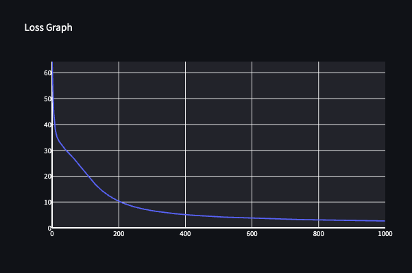

[](https://classroom.github.com/a/YFgwt0yY)
# MiniTorch Module 2


* Docs: https://minitorch.github.io/

* Overview: https://minitorch.github.io/module2/module2/

This assignment requires the following files from the previous assignments. You can get these by running

```bash
python sync_previous_module.py previous-module-dir current-module-dir
```

The files that will be synced are:

        minitorch/operators.py minitorch/module.py minitorch/autodiff.py minitorch/scalar.py minitorch/scalar_functions.py minitorch/module.py project/run_manual.py project/run_scalar.py project/datasets.py


# Task 2.5:
### Simple Data set
50 data points

4 hidden layer size

0.1 learning rate

1000 epochs

Train time: 1 min.




```
Epoch: 850/1000, loss: 2.9431071860486058, correct: 49
Epoch: 860/1000, loss: 2.921753058142755, correct: 49
Epoch: 870/1000, loss: 2.900890218690495, correct: 49
Epoch: 880/1000, loss: 2.8805015170349115, correct: 49
Epoch: 890/1000, loss: 2.8605706181358834, correct: 49
Epoch: 900/1000, loss: 2.8410819517520336, correct: 49
Epoch: 910/1000, loss: 2.822020665778621, correct: 49
Epoch: 920/1000, loss: 2.8033725832861744, correct: 49
Epoch: 930/1000, loss: 2.785124162868918, correct: 49
Epoch: 940/1000, loss: 2.7672624619659536, correct: 49
Epoch: 950/1000, loss: 2.749775102863034, correct: 49
Epoch: 960/1000, loss: 2.73265230912994, correct: 49
Epoch: 970/1000, loss: 2.715886964986607, correct: 49
Epoch: 980/1000, loss: 2.699466426914726, correct: 49
Epoch: 990/1000, loss: 2.6833774422414547, correct: 49
Epoch: 1000/1000, loss: 2.667613064382976, correct: 49
```

### Diag Data set
50 data points

4 hidden layer size

0.1 learning rate

1000 epochs

Train time: 1 min.


```
Epoch: 850/1000, loss: 1.5429184244571141, correct: 50
Epoch: 860/1000, loss: 1.518161472431724, correct: 50
Epoch: 870/1000, loss: 1.4939872319661827, correct: 50
Epoch: 880/1000, loss: 1.470376787110366, correct: 50
Epoch: 890/1000, loss: 1.4473120743134091, correct: 50
Epoch: 900/1000, loss: 1.4247758268586672, correct: 50
Epoch: 910/1000, loss: 1.4027515309881333, correct: 50
Epoch: 920/1000, loss: 1.3812233796009477, correct: 50
Epoch: 930/1000, loss: 1.3601762309920555, correct: 50
Epoch: 940/1000, loss: 1.3395955706699842, correct: 50
Epoch: 950/1000, loss: 1.3194674759903113, correct: 50
Epoch: 960/1000, loss: 1.2997785833620286, correct: 50
Epoch: 970/1000, loss: 1.2805160578059502, correct: 50
Epoch: 980/1000, loss: 1.2616675646649216, correct: 50
Epoch: 990/1000, loss: 1.2432212432845071, correct: 50
Epoch: 1000/1000, loss: 1.2251663478993517, correct: 50
```

### Split Data set
50 data points

6 hidden layer size

0.1 learning rate

1000 epochs

Train time: 1.8 min.


```
Epoch: 850/1000, loss: 1.8259632236146255, correct: 50
Epoch: 860/1000, loss: 1.787526826186543, correct: 50
Epoch: 870/1000, loss: 1.7504534775445992, correct: 50
Epoch: 880/1000, loss: 1.714655856376727, correct: 50
Epoch: 890/1000, loss: 1.6800559325421542, correct: 50
Epoch: 900/1000, loss: 1.6467197546179027, correct: 50
Epoch: 910/1000, loss: 1.6160984597864374, correct: 50
Epoch: 920/1000, loss: 1.5864352678045666, correct: 50
Epoch: 930/1000, loss: 1.5576873604253294, correct: 50
Epoch: 940/1000, loss: 1.529854760924203, correct: 50
Epoch: 950/1000, loss: 1.5028776581945247, correct: 50
Epoch: 960/1000, loss: 1.4766927855428102, correct: 50
Epoch: 970/1000, loss: 1.4512716922290736, correct: 50
Epoch: 980/1000, loss: 1.4265795059517457, correct: 50
Epoch: 990/1000, loss: 1.4025826054740114, correct: 50
Epoch: 1000/1000, loss: 1.3792529360318382, correct: 50
```

### XOR Data set
50 data points

10 hidden layer size

0.01 learning rate

1000 epochs

Train time: 4 min.


```
Epoch: 850/1000, loss: 4.920823376610206, correct: 49
Epoch: 860/1000, loss: 4.813605561671724, correct: 49
Epoch: 870/1000, loss: 4.709692835872912, correct: 49
Epoch: 880/1000, loss: 4.609053330659275, correct: 49
Epoch: 890/1000, loss: 4.511572940750585, correct: 49
Epoch: 900/1000, loss: 4.417153443801033, correct: 49
Epoch: 910/1000, loss: 4.325638226797292, correct: 50
Epoch: 920/1000, loss: 4.23653063361488, correct: 50
Epoch: 930/1000, loss: 4.149971126028667, correct: 50
Epoch: 940/1000, loss: 4.066222100159138, correct: 50
Epoch: 950/1000, loss: 3.9851438241505535, correct: 50
Epoch: 960/1000, loss: 3.9066278906844096, correct: 50
Epoch: 970/1000, loss: 3.8305688035926626, correct: 50
Epoch: 980/1000, loss: 3.7573157458011894, correct: 50
Epoch: 990/1000, loss: 3.686296598194047, correct: 50
Epoch: 1000/1000, loss: 3.617764397788816, correct: 50
```

### Circle Data set
50 data points

12 hidden layer size

0.1 learning rate

2000 epochs

Train time: 14 min.


```
Epoch: 1850/2000, loss: 2.6401478873061444, correct: 50
Epoch: 1860/2000, loss: 2.6251414407473894, correct: 50
Epoch: 1870/2000, loss: 2.5975366575844827, correct: 50
Epoch: 1880/2000, loss: 2.586484783916312, correct: 50
Epoch: 1890/2000, loss: 2.5771159957418637, correct: 50
Epoch: 1900/2000, loss: 2.568336717005302, correct: 50
Epoch: 1910/2000, loss: 2.568764822895583, correct: 50
Epoch: 1920/2000, loss: 2.5632089659671173, correct: 50
Epoch: 1930/2000, loss: 2.534076493700901, correct: 50
Epoch: 1940/2000, loss: 2.5209781029452643, correct: 50
Epoch: 1950/2000, loss: 2.519607858118745, correct: 50
Epoch: 1960/2000, loss: 2.5022071906547585, correct: 50
Epoch: 1970/2000, loss: 2.5328308750026878, correct: 50
Epoch: 1980/2000, loss: 2.5322989341348565, correct: 50
Epoch: 1990/2000, loss: 2.5098774757371074, correct: 50
Epoch: 2000/2000, loss: 2.4426015802669743, correct: 50
```
